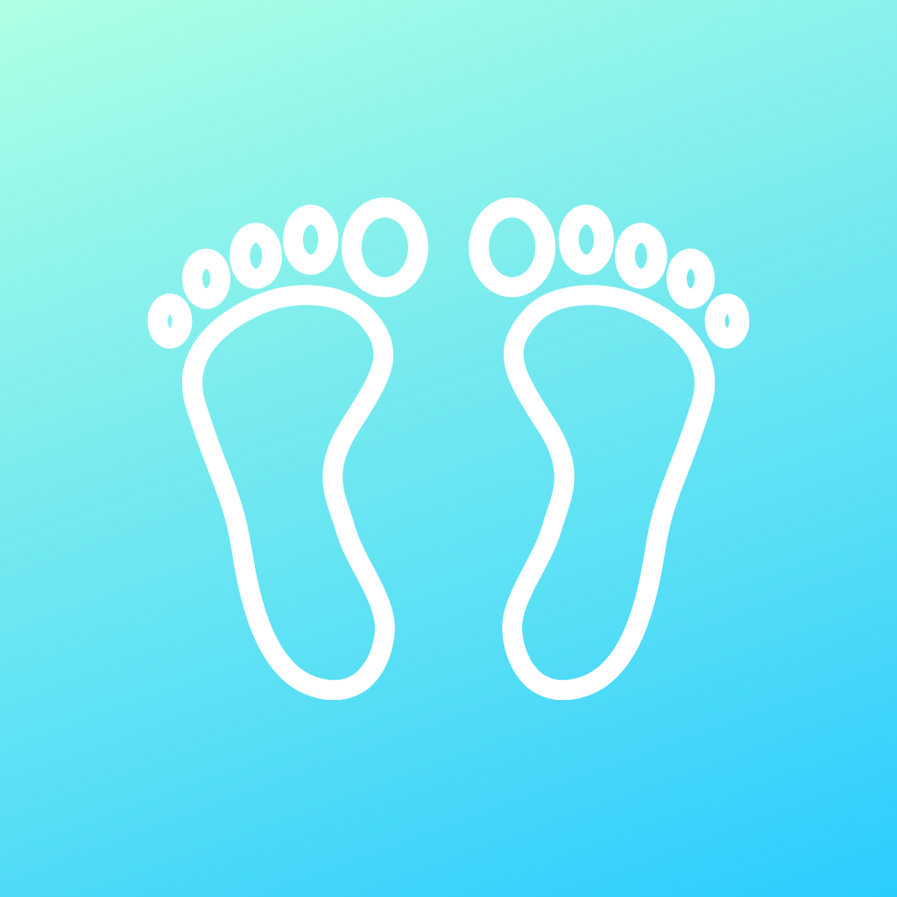

     

<h1 align="center">
  BMI Calculator
</h1> 

<h1 align="center">
     
</h1>

## Technologies and Concepts

* UIKit
* Model-View-Controller or MVC pattern for app development.
* Swift classes, structures and mutating functions.
* Object Oriented Programming.
* Programmatically change UI elements
* Multi-screen with segues